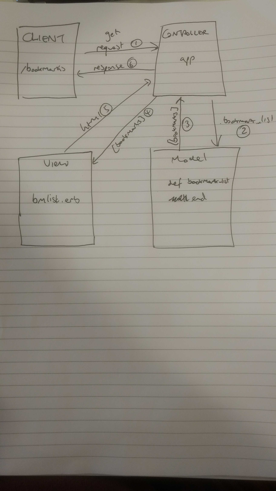

# Bookmark Manager


## User story 1
```
As a user
So that I can see my regular sites
I want to see a list of all my bookmarks
```
## Domain model 


## User story 2
```
As a time-pressed user
So that I can save a website
I would like to add the site's address and title to bookmark manager
```

## Database set up instructions for challenge 05_creating_your_first_table.md
```
CREATE TABLE bookmarks(
 id serial PRIMARY KEY,
 url VARCHAR (60)
);
```

## Database commands
```
postgres=# CREATE DATABASE "your_user_name_here"; = CREATE DATABASE
\l = lists databases
\d <table_name> = shows table columns 

eg: \d bookmarks 
                                       Table "public.bookmarks"
 Column |         Type          | Collation | Nullable |                Default                
--------+-----------------------+-----------+----------+---------------------------------------
 id     | integer               |           | not null | nextval('bookmarks_id_seq'::regclass)
 url    | character varying(60) |           |          | 
Indexes:
    "bookmarks_pkey" PRIMARY KEY, btree (id)

\dt =  lists tables 
\c <database> = allows you to change database eg: \c bookmark_manager
```